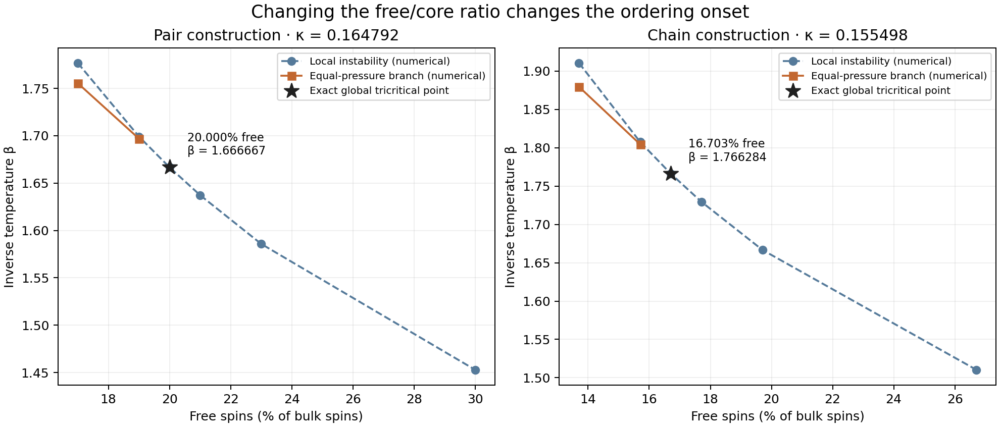

# Varying free spins changes the transition type

The ratio extension establishes exact tricritical points in **both** existing
component constructions. At their stated fixed couplings, increasing the free
fraction through these points changes the first ordering transition from an
abrupt jump to a continuous onset. The earlier 60%-free families remain the
reference constructions.

| Construction | Free fraction at tricriticality | Interacting fraction | β_t | κ_t |
|---|---:|---:|---:|---:|
| Negative pairs | 20% = 1/5 | 80% | 5/3 ≈ 1.666667 | 3log3/20 ≈ 0.164792 |
| Four-spin path plus four pairs | 77/461 ≈ 16.702820% | 384/461 ≈ 83.297180% | 461/261 ≈ 1.766284 | 261log3/1844 ≈ 0.155498 |

These ratios apply at the couplings in the table. They are not claimed as
κ-independent thresholds or as thresholds for the earlier κ=1 runs.
The model remains H=−(M²−N)/(2N)+κC_N with J=1. “Free” refers to absence of
sparse negative edges; all spins still participate in the dense mean field.

The stars are exact global tricritical points. Other plotted coordinates are
65-digit numerical branch solutions. The proof supplies continuous onset for
every f>f_t at κ_t, and first-order onset for f<f_t sufficiently close to f_t;
it does not assign a certified numerical radius to that neighborhood.

## What is established

- Exact factor decomposition realizes every rational free fraction without
  introducing new interacting components. Minimal tricritical cells contain
  5 spins for pairs and 461 spins for chains; the existing root/tail is retained.
- Both tricritical points have negative sixth cumulants and a global response
  inequality. A further 71-coefficient exact Bernstein certificate excludes
  any earlier ordered phase on cooling to either point.
- The ratio/temperature Jacobian is nonsingular with the required sign.
  This establishes the switch between continuous and discontinuous onset.
  Ordering grows as (β−β_t)^(1/4) exactly at tricriticality, rather than the
  ordinary square-root law on the continuous side.
- The same derivation gives critical ⟨(M/N)²⟩ proportional to N^(−1/3),
  with an explicit gamma-function amplitude. Because β_tκ_t=log3/4 in both
  families, their preserved roots have identical limiting equilibrium boundary
  weights. Finite-time memory still depends on the chosen dynamics/protocol.
- Separate global first-order examples exist at f=0,κ=1/5 in both families.
  Zero remains locally stable at every β, yet an ordered state has strictly
  higher pressure by β=4 for pairs and β=12 for chains. Certified pressure
  excesses exceed 0.04161255 and 0.11251009 respectively.
- A useful failed shortcut is retained: pair f=1/4,a=2/3 has zero quartic
  coefficient but **positive** sixth coefficient. Quartic zero alone would
  misclassify it.

The test result suggests strong contact with the concept.

## Numerical exploration

At fixed κ_t, pair f=0.19 has a stationary equal-pressure branch at
β≈1.6969275343 with magnetization jump ≈0.2727095002. The analogous chain
fraction f=77/461−0.01 gives β≈1.8045463468 and jump ≈0.2720906275.
These are retained numerical branch solutions, distinct from the exact global
theorems. Twelve ratio/temperature branch records are in RESULTS.json.

The principal worker completed 50 exact/directed checks in about 7.25 seconds
on one pod CPU core. It enumerated all 4 pair states and 4,096 chain-core
states independently of the component formulas. No large-N spectrum was
expanded, and no GPU kernel was needed for this question.

## Reproduction and records

Read [PROOF.md](PROOF.md) for the model, integer graph construction, exact
inequalities and global-to-local transition argument. [DESIGN.md](DESIGN.md)
records scope and provenance. RESULTS.json contains cumulants, rational
certificates, directed bounds and numerical branches; EXTENSION.json contains
the full high-temperature certificates. VERIFY.json records independent
checks and actual custody; CUSTODY.json identifies the verified archive.

The source-bound STARBREAKER adapters are native_run.py and extension_run.py;
their frozen bindings, native results, exports and checkpoints are retained.
The new worker uses the same pinned pod environment as spin_transition1.
One extension attempt finished its calculations but failed to create its
output directory; the failed code/log/session are preserved, and the corrected
worker was rerun. A busy resource-manager lock was respected before retrying.

Sean Brady selected the ratio extension. Codex developed the mathematics,
execution and documentation. Historical campaigns and the unpublished paper
remain immutable. No public repository was updated by this campaign.

## Highest-value next step

Compute **finite-N boundary memory across the chain tricritical point**, using
the unchanged boundary protocol and these new exact factors. This asks whether
the newly established abrupt bulk onset produces a corresponding sharp change
in preparation, between-stage or within-stage memory. The ratio study now
supplies concrete parameters and a global transition classification for that
calculation, rather than a blind scan.
