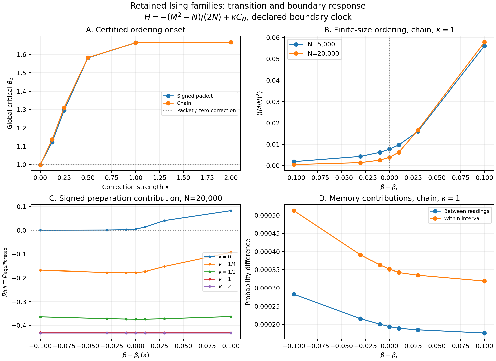

# Global transition, boundary memory and occupied exact counts

**The previous local threshold is now established as the global continuous
ordering onset for the retained packet families at every fixed finite
kappa>=0.** A finite exact polynomial certificate excludes a distant ordered
state taking over earlier. The campaign also derives the critical fluctuation
amplitude and an exact boundary-memory limit, maps158certified finite cases,
and reconstructs275104selected exact counts in thermally occupied windows.

This is a new derivation within this project for the explicit model
H=-(M²-N)/(2N)+kappa*C_N,J=1. It makes no literature-priority claim.
The archived whole-scaled model kappa=1/N and prior unpublished draft remain
unchanged. The result concerns the retained repeated-component families;
it does not identify all frustrated Ising graphs with these sources.

[Full derivation](PROOF.md) · [Methodology/reproduction](METHODOLOGY.md) ·
[Vector figure](TRANSITION_MAP.pdf) · [Plot data](PLOT_DATA.csv) ·
[Exact certificate](THEOREM.json) · [Verification](VERIFY.json)

## Actual transition and its scope

The repeated-component magnetization satisfies m_0(y)<chi*y for every y>0.
The certificate uses71nonnegative rational Bernstein coefficients, with exact
reconstruction of both power-basis polynomials. The threshold beta_c*chi=1
therefore separates the unique disordered global maximum from ordered maxima.
Continuity follows from global uniqueness at beta_c and the negative quartic
coefficient. The stronger global-concavity route is false; two exact arithmetic
counterexamples are preserved and that route is not used.

| Fixed kappa | Signed-packet beta_c | Chain beta_c |
|---:|---:|---:|
| 0 | 1.000000000000 | 1.000000000000 |
| 1/8 | 1.122873781777 | 1.136842176652 |
| 1/4 | 1.295422047875 | 1.310642690959 |
| 1/2 | 1.581042157548 | 1.582234699504 |
| 1 | 1.663814710634 | 1.663815941534 |
| 2 | 1.666663067473 | 1.666663067475 |

The chain threshold exceeds the signed-packet threshold for every finite positive
kappa: chi_chain-chi_signed=-a(1-a)²/15, a=tanh(2beta*kappa). Both thresholds
approach5/3 at strong correction strength. Packet and kappa0 have beta_c=1.
The theorem establishes the first ordering transition, not a census of every
stationary point arbitrarily far above it.

At exact critical beta, sqrt(N)*<(M/N)²> tends to an explicit gamma-function
amplitude. For the chain at kappa1 it is
**0.546951358570**. At the finite map's12-decimal temperature
centers, <(M/N)²> is0.0077033393 atN5000 and0.0038595576 atN20000.
The exact-temperature asymptotic statement and rounded finite inputs are
distinguished in the derivation and results.

## Boundary memory: finite map and exact limiting readout

The map covers N5000/20000, five correction strengths and seven offsets around
each transition, plus packet controls and four independent N200checks.
All158cases use complete128-bit Arb integrals with explicit infinite tails.
Minimum retained boundary-weight relative accuracy is67bits.
The84direct checks expand the N200integer spectrum and sum Gibbs weights at
192bits, independently of the Gaussian integration. The12-worker thermal stage
took9.398738s, excluding the subsequent window stage.

AtN20000,rounded critical beta,chain family:

| kappa | Preparation | Between readings | Within interval |
|---:|---:|---:|---:|
| 0 | 0.004753155978 | 6.668586642e-06 | 8.777513777e-06 |
| 1/4 | -0.1779055081 | 0.007528130739 | 0.01100672542 |
| 1/2 | -0.3739697942 | 0.004880989808 | 0.008417177547 |
| 1 | -0.4304021498 | 0.0001940086515 | 0.0003516617622 |
| 2 | -0.4323299233 | 2.46174133e-07 | 4.469810603e-07 |

Preparation is the signed difference between the specified state0start and a
conditionally equilibrated start inside its initial coarse class. The latter
is not a globally stationary initial mixture. The declared one-third heat-bath
clock and original postselection/readout are unchanged. The grid has
42positive and116negative preparation values;
between-readings and within-interval contributions are positive in all158cases.

Below and at onset, complete boundary weights have the exact limit
Z_b/Z_0 -> R_b(0)/R_0(0). Applying the unchanged protocol to these finite root
ratios gives the limiting memory directly; no huge-N extrapolation is needed.
At the chain's exact kappa1critical point the limits are:

- Preparation: -0.430454602216
- Between readings: 0.000189921648477
- Within interval: 0.000344266087525

These directed intervals establish a nonzero limiting boundary response for
this model/clock. LIMITS.json includes18critical curve/root-limit evaluations.

## Exact occupied windows and the better execution route

| N | Final records | Exact zeros | CPU coefficients(s) | GPU route(s) | Common root/output/mass(s) |
|---:|---:|---:|---:|---:|---:|
| 5,000 | 69,904 | 2,056 | 0.268194 | 0.651927 | 4.259603 |
| 20,000 | 205,200 | 4,104 | 7.009639 | 67.463268 | 72.866565 |

CPU and GPU agree on all17800intermediate coefficients; global reversal agrees
on all275104final records. Zero counts are retained. At aligned index0,
boundary states0,3,4,7,8,11,12,15are forbidden by the exact root constraints,
accounting for the6160zero records. Every record carries original E,M,b labels.

The mathematical shortcut is to count the few aligned negative edges instead
of advancing through thousands of central defect coefficients. Reversing the
variable gives a monomial initial coefficient32X^6 and requires only16/24exact
recurrence steps. For the N20000window the CPU coefficient route is about
9.62times faster than the matched GPU route. This changes the preferred engine
for this thermally occupied low-aligned-index regime. The earlier GPU advantage
for central-defect windows remains valid in its own regime.

The GPU still supplies an independent exact modular comparison. Its full
modular transforms are unchanged; selected transfer and CRT avoid full-spectrum
materialization. AtN20000it transfers13188coefficients over328moduli;
34,605,312residue bytes; live CuPy pool peak2,684,464,640bytes.
Transforms/transfer took52.668900s and CPU CRT/readout14.785595s.
These coefficient timings exclude common final root contraction, serialization
and probability summation, shown separately above. Exporting all decimal count
records now costs more than the optimized CPU coefficients themselves.

## Measured probability coverage

N5000window: k2372..2628,t0..16. N20000window: k9744..10256,t0..24.
Here t is the number of aligned negative edges, d=L-t,all16boundary states.
The zero-field local law guided selection; complete certified Z determines the
actual captured and omitted Gibbs probability:

| N | beta-beta_c | Captured | Omitted |
|---:|---:|---:|---:|
| 5,000 | -0.03 | 53.607483% | 46.392517% |
| 5,000 | 0 | 37.267444% | 62.732556% |
| 5,000 | 0.03 | 17.264479% | 82.735521% |
| 20,000 | -0.03 | 49.115916% | 50.884084% |
| 20,000 | 0 | 26.387738% | 73.612262% |
| 20,000 | 0.03 | 2.021312% | 97.978688% |

These windows capture substantial probability at/below the transition,
replacing the previous effectively empty central-energy window. Above onset,
separating magnetization peaks move outside a window centered at M=0; the
N20000coverage at+0.03 falls to2.02%. That is explicit measured coverage,
not an assumption that a selected table represents the entire distribution.

**Highest-value next step:** follow the two moving magnetization peaks above
onset, using the reversed-variable CPU recurrence and measured omitted mass.
Retaining compact intermediate coefficients plus exact root reconstruction
would avoid repeated full-decimal export while preserving lossless access.
No automatic successor campaign has been launched.

## Documentation and custody

METHODOLOGY.md records the model, exact source lineage, original energy map,
hardware, clock, precision, parallelism, timing boundaries and reproduction.
The deployment race and zero-count output-check failure are retained with
their original logs/code/native sessions. Completed thermal calculations were
reused only after their scientific source/code identities matched.

Native SPIN_TRANSITION_MAP and SPIN_TRANSITION_LIMIT calls use STARBREAKER /
SB-GEN3-ACCUMULATION-R1 / SLC-GEN3-R4 / SLC-GEN3-CEV1-R4. Exports and
checkpoints remain under the bulk directory. Scoped adapters are not generic
engine promotions. Chalkboard remains suspended; no prime-event or helper
compute changes, public upload or earlier-manuscript overwrite.

Bulk: /home/sam/mnt/lilhelper-t500/GEN4/spin_transition1.
176remote artifact hashes match T500, including failed-attempt records.
Both count gzip streams pass complete uncompressed hash/record-count readback.
CUSTODY.json records the full archive readback. Pod originals remain; T500
originals and archive share a physical disk. Workers complete; pod remains rented.
